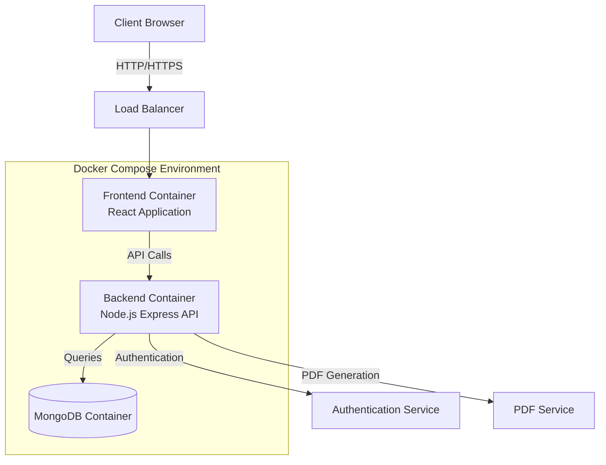

# Architecture Diagram

The architecture follows a modern microservices approach with the following components:

1. **Frontend**: React SPA (Single Page Application) delivered via Nginx
2. **Backend API**: Node.js with Express handling business logic
3. **Database**: MongoDB for data persistence
4. **Authentication Service**: JWT-based authentication
5. **PDF Service**: PDF generation for payslips

All components run in Docker containers orchestrated by Docker Compose.
